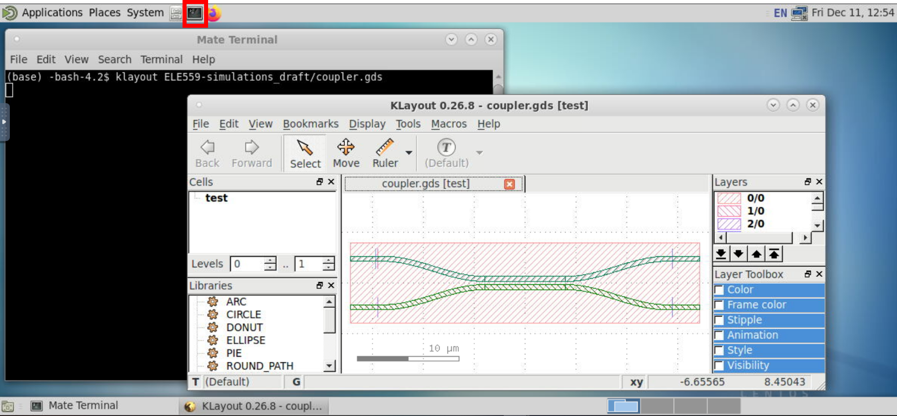

# ELE559-simulations
Workshop on photonic device and circuit simulation using open-source tools. Created for Princeton's Spring 2020 ELE559 : Photonic Systems class.

## Log in to Adroit

https://myadroit.princeton.edu/
Requesting access (Princeton students) : https://researchcomputing.princeton.edu/access

## Checkout environment

Navigate to the shell


Run this command :

```
git clone https://github.com/simbilod/ELE559-simulations
```


## Start up the Jupyter server

Under "My interactive sessions", click on Jupyter for classes :


Optionally, check the box for Jupyter Lab. Fill in your requested time and cores (be considerate to other users). Then click launch. When the environment is ready, launch it.


## Opening a Notebook

You will see an interface like this :


You should see multiple Python environments when you log in (mp, pmp, layout, etc.). Make sure you select the "mp" environments when you boot the Notebooks. You can change what environment you are running on by clicking the text besides the dot on the top right :


## Using a Notebook

Execute a cell by pressing `shift+enter`. The output will be displayed right underneath. The added text should provide enough context to follow!

More on Jupyter Notebooks : https://www.dataquest.io/blog/jupyter-notebook-tutorial/

## Manually making an environment visible

Jupyter should auto-detect the environments, but if for some reason it does not you can manually add them. 

Go to the shell (see "Checkout environment") and type

```
conda info --envs
```
to list the environments. Activate the environment you want to add by typing
```
conda activate environment_name
```
Then link the environment "environment_name" to your Jupyter kernel with label "my_environment_name" by running
```
python -m ipykernel install --user --name=my_environment_name
```
You should get the following response :

Restart the Jupyter for Classes server and you should see the environment under the name you assigned.

## Accessing KLayout GUI from the myAdroit Desktop 

To see the GDS files you have designed on the server itself, you can use the preinstalled KLayout on the Desktop app.

First, (optionally) create an alias to open KLayout in your .bashrc. In the shell (see "Checkout environment") type

```
cd
nano .bashrc
```
and add the lines
```
# KLayout location
export LD_LIBRARY_PATH=$LD_LIBRARY_PATH:/usr/lib64
export LD_LIBRARY_PATH=$LD_LIBRARY_PATH:/home/ELE559/klayout-0.26.8/bin-release
alias klayout="/home/ELE559/klayout-0.26.8/bin-release/klayout"
```
Then, open the desktop app like you would a Jupyter for Classes session. Open a terminal and type
```klayout```
(or full link from the alias) to open the program.



## Objective

In the long term, this will consist of mostly Python-based workflow and utilities to connect open-source photonic circuit layout and simulation software :

[link to Google!](http://google.com)

* [zeropdk](https://github.com/lightwave-lab/zeropdk) for GDSII layout
* Meshing of the GDSII via [libGDSII](https://github.com/HomerReid/libGDSII)
* [DEVSIM](https://github.com/devsim/devsim) for semiconductor simulations
** Potentially [Charon](https://charon.sandia.gov/) for MPI compatibility if the interface can be worked out 
** Electrical ports from zeropdk as boundary conditions
* [MEEP](https://github.com/NanoComp/meep) for electromagnetic simulations
** Already MPI-compatible
** Optical ports of zeropdk as sources and monitors
** Optionally index distribution from semiconductor simulation
* S-parameter extraction from the simulations above to generate compact models for use with large-scale circuit simulations such as [Simphony](https://github.com/simphony) or [PhotonTorch](https://github.com/flaport/photontorch)